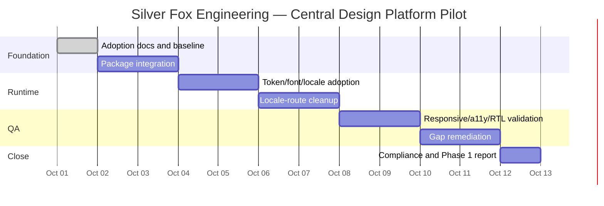

# Silver Fox Engineering Pilot Gantt

```mermaid
gantt
    title Silver Fox Engineering — Central Design Platform Pilot
    dateFormat  YYYY-MM-DD
    axisFormat  %b %d

    section Foundation
    Adoption docs and baseline       :done, e0, 2026-10-01, 1d
    Package integration              :e1, after e0, 2d

    section Runtime
    Token/font/locale adoption       :e2, after e1, 2d
    Locale-route cleanup             :e3, after e2, 2d

    section QA
    Responsive/a11y/RTL validation   :e4, after e3, 2d
    Gap remediation                  :e5, after e4, 2d

    section Close
    Compliance and Phase 1 report    :e6, after e5, 1d
```

The milestone gate is authoritative; dates are planning guidance, not delivery promises.
