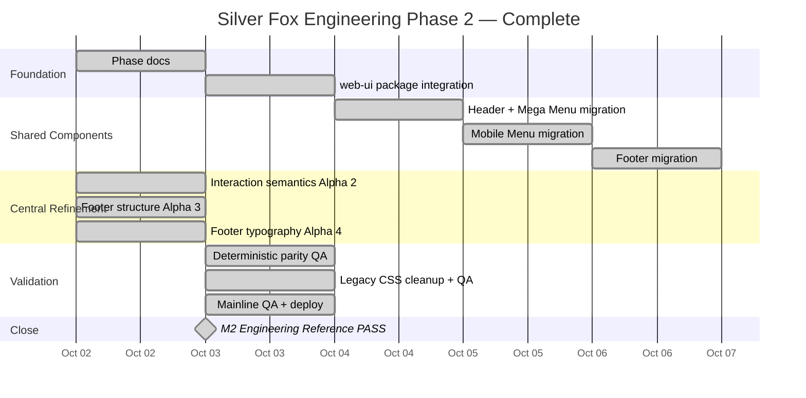

# Phase 2 Gantt — Engineering Shared Component Migration

```mermaid
gantt
    title Silver Fox Engineering Phase 2 — Complete
    dateFormat  YYYY-MM-DD
    axisFormat  %b %d

    section Foundation
    Phase docs                         :done, e20, 2026-10-02, 1d
    web-ui package integration         :done, e21, after e20, 1d

    section Shared Components
    Header + Mega Menu migration       :done, e22, after e21, 1d
    Mobile Menu migration              :done, e23, after e22, 1d
    Footer migration                   :done, e24, after e23, 1d

    section Central Refinement
    Interaction semantics Alpha 2      :done, e25, 2026-10-02, 1d
    Footer structure Alpha 3           :done, e26, 2026-10-02, 1d
    Footer typography Alpha 4          :done, e27, 2026-10-02, 1d

    section Validation
    Deterministic parity QA            :done, e28, 2026-10-03, 1d
    Legacy CSS cleanup + QA            :done, e29, 2026-10-03, 1d
    Mainline QA + deploy               :done, e30, 2026-10-03, 1d

    section Close
    M2 Engineering Reference PASS      :milestone, done, e31, 2026-10-03, 0d
```

Milestone evidence, not elapsed time, is authoritative.
