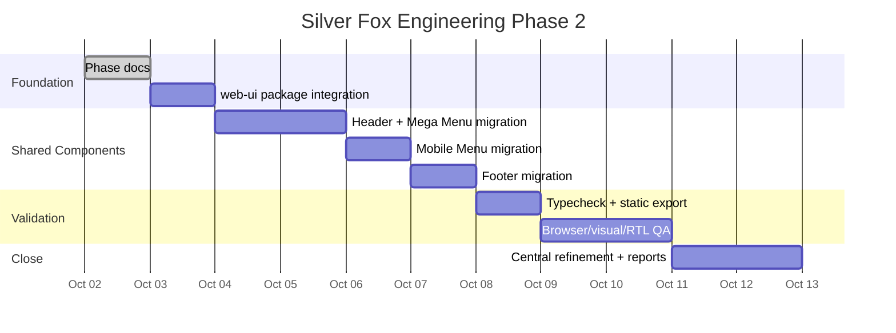

# Phase 2 Gantt — Engineering Shared Component Migration

```mermaid
gantt
    title Silver Fox Engineering Phase 2
    dateFormat  YYYY-MM-DD
    axisFormat  %b %d

    section Foundation
    Phase docs                         :done, e20, 2026-10-02, 1d
    web-ui package integration         :e21, after e20, 1d

    section Shared Components
    Header + Mega Menu migration       :e22, after e21, 2d
    Mobile Menu migration              :e23, after e22, 1d
    Footer migration                   :e24, after e23, 1d

    section Validation
    Typecheck + static export          :e25, after e24, 1d
    Browser/visual/RTL QA              :e26, after e25, 2d

    section Close
    Central refinement + reports       :e27, after e26, 2d
```

Milestone evidence controls closure; dates are planning guidance.
